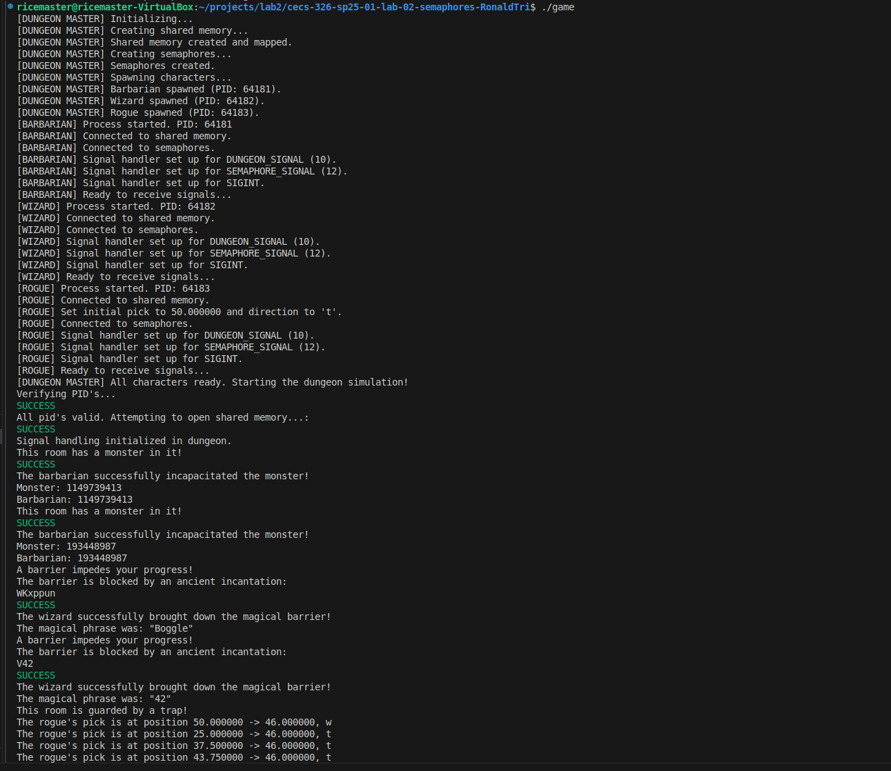
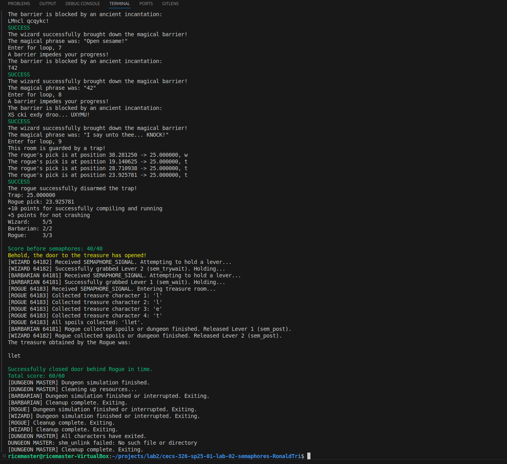

# CECS 326 Lab 2: Concurrent RPG Game (Shared Memory & Semaphores)

## 🚀 Project Overview

This project implements an **RPG-based game** using **concurrent processing** on a POSIX (Unix/Linux) system. The primary goal was to gain hands-on experience with **inter-process communication (IPC)** via **shared memory** and **process synchronization** using **semaphores**.

The game features four distinct processes: a central **Dungeon** process that manages game state, and three character processes – a **Barbarian**, a **Wizard**, and a **Rogue** – which interact with the dungeon through shared memory and signals.

## ✨ Features & Technologies Demonstrated

* **Concurrent Programming:** Design and execution of multiple co-existing processes (`fork()`, `exec()`).
* **Shared Memory (System V IPC):** Implemented a central `Dungeon` struct in shared memory to allow real-time communication and state updates between all game processes.
* **Semaphores:** Utilized named semaphores (`sem_wait`, `sem_post`) to coordinate access to critical sections, specifically to "hold" a door open for the Rogue character.
* **Signal Handling:** Configured robust signal handlers (`sigaction`) for each character process to react to game events without crashing.
* **Algorithmic Problem-Solving:**
    * **Caesar Cipher Decoder:** Implemented a decoder for the Wizard character to solve a spell puzzle.
    * **Binary Search:** Utilized a binary search algorithm for the Rogue character to efficiently "pick" a lock by guessing a floating-point value.
* **Makefile:** Managed the compilation and linking of all C source files and provided object files.
* **Environment:** Developed and tested on a Linux virtual machine (POSIX system).

## 🎮 Game Play Overview

In this RPG, players control three characters attempting to navigate a dungeon:
* **Barbarian:** Attacks enemies by mirroring health values, demonstrating direct shared memory interaction.
* **Wizard:** Decodes Caesar ciphers to solve magical barriers.
* **Rogue:** Picks complex locks using a binary search approach to find a precise value.

The final challenge involves the Barbarian and Wizard cooperating with semaphores to allow the Rogue to safely acquire treasure from a locked room.

## ⚙️ How to Compile and Run

To compile and run this project, ensure you have `gcc` and `make` installed on a Linux/Unix system.

1.  **Clone the repository:**
    ```bash
    git clone [https://github.com/RonaldTri/326-Project.git](https://github.com/RonaldTri/326-Project.git)
    cd 326-Project
    ```
2.  **Compile the project:**
    ```bash
    make
    ```
3.  **Run the game:**
    ```bash
    ./game
    ```

## 📸 Screenshots / Demos


*A screenshot showing the game in action.*


*Another screenshot demonstrating a key feature (e.g., semaphores in action, or the rogue picking a lock).*

## 🤝 Contributions

This was an individual academic project.